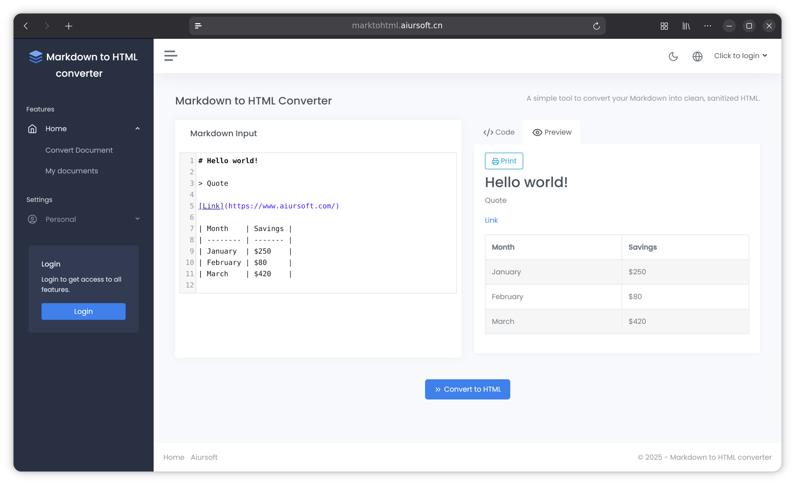

# MoongladeV2

[](https://gitlab.aiursoft.com/aiursoft/moongladeV2/-/blob/master/LICENSE)
[](https://gitlab.aiursoft.com/aiursoft/moongladeV2/-/pipelines)
[](https://gitlab.aiursoft.com/aiursoft/moongladeV2/-/pipelines)
[](https://manhours.aiursoft.com/r/gitlab.aiursoft.com/aiursoft/moongladeV2.html)
[](https://moongladeV2.aiursoft.com)
[](https://hub.docker.com/r/aiursoft/moongladeV2)

A simple tool to convert your Markdown into clean, sanitized HTML.



Default user name is `admin@default.com` and default password is `Admin@123456!`.

## Try

Try a running MoongladeV2 [here](https://moongladeV2.aiursoft.com).

## Why MoongladeV2 for Your Organization

MoongladeV2 is a production-ready, enterprise-grade knowledge base platform designed for teams that value simplicity without sacrificing essential features. While commercial solutions like Notion charge $10+ per user monthly and lack self-hosting options, MoongladeV2 delivers a comprehensive document collaboration system that deploys in minutes and costs nothing to run on your own infrastructure.

Key enterprise features include:

**Flexible Data Infrastructure.** Seamlessly switch between SQLite for quick deployment, MySQL for scalability, SQL Server for enterprise environments, or in-memory databases for testing. No complex configuration required.

**Enterprise Authentication.** Native OpenID Connect integration allows seamless connection to your existing identity provider with automatic role synchronization. Built-in user management provides a complete authentication solution out of the box.

**Fine-Grained Access Control.** Role-Based Access Control system with comprehensive permissions for users, roles, and documents. Dynamic navigation automatically adapts to user permissions, ensuring users only see what they should.

**Global-Ready Platform.** AI-powered translation supporting 27 languages enables worldwide team collaboration without language barriers. Comprehensive localization coverage ensures consistent user experience across cultures.

## Run in Ubuntu

The following script will install\update this app on your Ubuntu server. Supports Ubuntu 25.04.

On your Ubuntu server, run the following command:

```bash
curl -sL https://gitlab.aiursoft.com/aiursoft/moongladeV2/-/raw/master/install.sh | sudo bash
```

Of course it is suggested that append a custom port number to the command:

```bash
curl -sL https://gitlab.aiursoft.com/aiursoft/moongladeV2/-/raw/master/install.sh | sudo bash -s 8080
```

It will install the app as a systemd service, and start it automatically. Binary files will be located at `/opt/apps`. Service files will be located at `/etc/systemd/system`.

## Run manually

Requirements about how to run

1. Install [.NET 10 SDK](http://dot.net/) and [Node.js](https://nodejs.org/).
2. Execute `npm install` at `wwwroot` folder to install the dependencies.
3. Execute `dotnet run` to run the app.
4. Use your browser to view [http://localhost:5000](http://localhost:5000).

## Run in Microsoft Visual Studio

1. Open the `.sln` file in the project path.
2. Press `F5` to run the app.

## Run in Docker

First, install Docker [here](https://docs.docker.com/get-docker/).

Then run the following commands in a Linux shell:

```bash
image=aiursoft/moongladeV2
appName=moongladeV2
sudo docker pull $image
sudo docker run -d --name $appName --restart unless-stopped -p 5000:5000 -v /var/www/$appName:/data $image
```

That will start a web server at `http://localhost:5000` and you can test the app.

The docker image has the following context:

| Properties  | Value                           |
|-------------|---------------------------------|
| Image       | aiursoft/moongladeV2         |
| Ports       | 5000                            |
| Binary path | /app                            |
| Data path   | /data                           |
| Config path | /data/appsettings.json          |

## How to contribute

There are many ways to contribute to the project: logging bugs, submitting pull requests, reporting issues, and creating suggestions.

Even if you with push rights on the repository, you should create a personal fork and create feature branches there when you need them. This keeps the main repository clean and your workflow cruft out of sight.

We're also interested in your feedback on the future of this project. You can submit a suggestion or feature request through the issue tracker. To make this process more effective, we're asking that these include more information to help define them more clearly.
